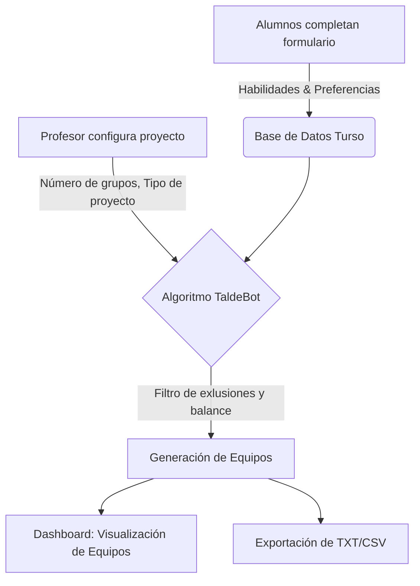

# TaldeBot: Documentación Arquitectónica y Experiencia de Desarrollo

TaldeBot es una plataforma inteligente para la gestión y creación de grupos de trabajo universitarios. Su objetivo principal es asegurar la formación de grupos equilibrados, eficientes y sanos mediante la evaluación de habilidades, el tipo de proyecto y las relaciones interpersonales de los alumnos.

A continuación, se detalla el funcionamiento de la aplicación, la evolución de su algoritmo central, la arquitectura técnica empleada, su despliegue, y una retrospectiva sobre la experiencia de construir TaldeBot desde cero junto a Antigravity.

---

## 1. ¿Cómo funciona la aplicación?

TaldeBot divide su flujo en dos partes principales: **Alumnos** y **Administradores (Profesores)**.

*   **Para el Alumno**: Completan un formulario donde se auto-evalúan en diferentes ramas: Narrativa, Técnica, Gestión y Soft Skills. Además, seleccionan sus preferencias interpersonales: con quién desean trabajar (Comfort Zone) y a quién prefieren evitar (Límites).
*   **Para el Administrador**: Disponen de un panel de control interactivo donde pueden visualizar el aula (Floorplan), revisar el estado de las encuestas y ejecutar el **Algoritmo de Emparejamiento**. Una vez ejecutado, el sistema genera grupos y justifica detalladamente por qué cada alumno fue asignado a su equipo.

### Pequeño Diagrama de Flujo (Mermaid)

---

## 2. Evolución del Algoritmo (De V1 a V2)

El núcleo de TaldeBot es su algoritmo de asignación, el cual se enfrenta a una variante del clásico problema *NP-hard* de emparejamiento. A lo largo del desarrollo, el algoritmo tuvo que evolucionar para resolver bloqueos y mejorar el reparto.

### Version 1 (El modelo inicial)
*   **Restricciones de rechazo estrictas (Hard Constraints)**: Si un alumno marcaba a otro con "evitar", el algoritmo descartaba absolutamente esa combinación asignándole un puntaje inmensamente negativo (`-10000`). Esto generaba cuellos de botella matemáticos y fallos en la asignación cuando había muchos alumnos inter-rechazados.
*   **Zona de confort amplia**: Los estudiantes podían elegir a múltiples compañeros como su "Zona de Confort" (hasta 6), lo cual llevaba a agrupaciones endogámicas y limitaba la variedad de los equipos.

### Version 2 (El modelo actual y optimizado)
*   **Restricciones de rechazo suaves (Soft Constraints)**: Los bloqueos pasaron a ser una penalización (`-300`). El algoritmo hace todo lo posible por respetarlo, pero si no hay más remedio para cuadrar los grupos, lo permite. Así se evita el colapso del sistema.
*   **El concepto del "Renegado"**: Se introdujo una regla para identificar a aquellos alumnos que son rechazados por múltiples personas (más de 3) y el algoritmo se encarga de no concentrar a varios "renegados" en un mismo equipo.
*   **Anchor Person (Persona Ancla)**: Se redujo la zona de confort a una **única** elección. Esto permite garantizar que el alumno tenga al menos una cara conocida o amigable dentro de su grupo (un ancla), promoviendo que el resto del grupo sean personas diferentes y fomentando la socialización sin causar estrés.

---

## 3. Arquitectura y Stack Tecnológico

El proyecto está construido bajo una arquitectura moderna orientada a la velocidad y el rendimiento en el Edge, sin sacrificar la interactividad del usuario.

*   **Entorno / Framework**: Construido sobre **Astro**, utilizando su modelo de Server-Side Rendering (SSR). Esto permite entregar HTML rápido y generar rutas seguras.
*   **Frontend**: Mezcla de Astro puro para las partes estáticas y componentes **React** para las partes más interactivas complejas (como la vista de "Floorplan" y las listas drag-and-drop).
*   **Estilos**: **Tailwind CSS**. Garantiza un diseño visual premium, con interfaces limpias, botones atractivos y excelente responsividad.
*   **Base de Datos**: **Turso (SQLite v2)** vía **LibSQL**. Turso es una base de datos distribuida ideal para correr geográficamente cerca de las funciones del Edge.
*   **ORM**: **Drizzle ORM**. Ligero, tipeado de extremo a extremo y excelente en su integración con TypeScript.

---

## 4. Infraestructura y Despliegue (Deployment)

El despliegue combina simplicidad y rendimiento global:

*   **Netlify (Hosting y Serverless)**: El proyecto utiliza el adaptador `@astrojs/netlify`. Esto significa que cada invocación a una API (ej. la generación de equipos) o el renderizado de una vista protegida, no ocurren en un servidor monolítico tradicional, sino que se procesan como *Edge Functions / Serverless Functions* directamente en la infraestructura de Netlify.
*   **Turso (Datos Serverless)**: La base de datos no es un servicio pesado como Postgres tradicional en un VPS. SQLite replicado a través de Turso permite tiempos de respuesta intercontinentales mínimos (Edge Database). Esto elimina cuellos de botella típicos de latencia entre el frontend de Netlify y la base de datos.
*   **CI/CD**: Netlify está conectado al repositorio para realizar construcciones continuas ante cada modificación del código, gestionando en sus variables de entorno de manera segura los tokens de Turso y contraseñas de administración.

---

## 5. La Experiencia de construir TaldeBot de 0 con Antigravity

El proceso de desarrollo de TaldeBot mano a mano con Antigravity (IA) ha sido una experiencia de *Pair Programming* radical, iterativa y de alta velocidad.

1.  **Iteración de UI/UX**: Se comenzó planteando layouts atractivos y funcionales. Desde refactorizar el `FloorPlan` para que abandonase un sistema de coordenadas antiguo hasta convertirlo en un espacio visualmente dinámico (Flexbox / Drag-and-drop).
2.  **Modularidad y Refactorización Continua**: Antigravity permitió absorber toda la complejidad técnica necesaria, diagnosticando bugs silenciosos (como los problemas del TypeScript en `justify-between` o fallos en los tipados de exportación de CSV). Esto facilitó que **la atención del usuario** se mantuviese constantemente en las *reglas del negocio* y la *lógica humana* (¿Cómo mejoramos a los alumnos?), en lugar del estrés técnico.
3.  **Velocidad de Adaptación**: A medida que los requerimientos de la escuela o los profesores cambiaban (ej. pasar del sistema de Comfort Zone a Anchor Person), Antigravity reescribió la lógica matemática del algoritmo y de la UI en fracciones de tiempo, sin perder consistencia, gestionando también la versión del algoritmo (v1 vs v2) e incluso scripts de migración dentro de la Base de Datos automáticamente.
4.  **Cero a Producción**: TaldeBot pasó de ser una idea abstracta a una aplicación full-stack interactiva, con base de datos en tiempo real, autenticación de panel y despliegue a la red pública en procesos de toma de decisión fluidos y sin bloqueos de arquitectura gracias a las recomendaciones del agente.
